# CONTRIBUTING.md

## Project Overview

This project implements Predictive Maintenance API with real-time monitoring at production level having the following details -

1. **End-to-End ML Pipeline Automation**
	-  Data validation & preprocessing with Pandas/NumPy (feature engineering, missing value handling)
	- Automated model training using Scikit-learn/XGBoost with Optuna for hyperparameter tuning
	-  MLflow for experiment tracking, model registry, and metadata logging (accuracy, training time, hyperparameters)
	- DVC for dataset versioning and reproducibility
2. **Cloud-Based Deployment Infrastructure**
	-  AWS EC2 for model hosting with FastAPI REST endpoints
	-   Docker containerization of entire application (model, API, dependencies)
	-  Kubernetes orchestration for scaling prediction services
	-  Terraform for Infrastructure-as-Code IaC) provisioning
3. **CI/CD Implementation**
	-  GitHub Actions for automated testing PyTest and deployment
	-  Model validation gates checking accuracy thresholds 90%) before production deployment
	-  Automated rollback to previous model version if monitoring detects performance degradation
4. **Production Monitoring System**
	-  Evidently AI dashboards tracking data drift PSI  0.2 triggers alerts)
	-  Prometheus/Grafana for API latency monitoring 95th percentile < 200ms)
	-  Custom logging with Loguru capturing prediction inputs/outputs for audit trails
5. **Collaboration & Documentation**
	- Cookiecutter template enforcing project structure consistency
	-  Sphinx auto-generated documentation from code annotations
	- Jupyter Notebooks with MLflow UI integration showing experimental history

## Development Setup

- Create virtual environment: `python -m venv .venv`; activate with `source .venv/bin/activate` (Linux/Mac) or `.\\.venv\\Scripts\\Activate.ps1` (Windows).
- Install dependencies: `python -m pip install -U pip`, `python -m pip install -r requirements.txt`, `python -m pip install -r requirements-dev.txt`.
- Run local pipeline: `python -m src.monitoring.validate_data`, `python -m src.monitoring.data_preprocessing`, `python -m src.monitoring.train_model`.

## Testing Production Features

Test using ephemeral EKS clusters for production-like validation.

### 1. End-to-End Pipeline

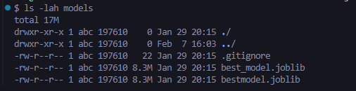
*Generated model directory*

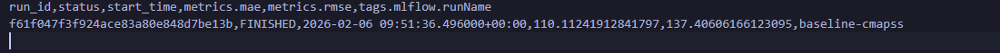
*Artifact generated after run of "02_compare_runs.ipynb"*

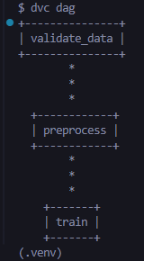

*Output of "dvc dag"*

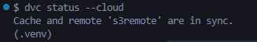

*Output of "dvc status --cloud"*

### 2. Cloud Deployment

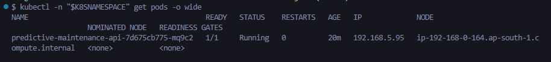
*Running pod in AWS EKS cluster*

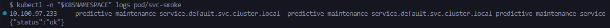
*In-cluster smoke test logs*

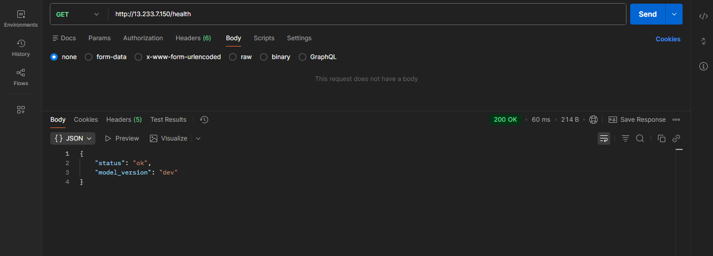
*Health check of running API with infrastructure provisioned using Terraform*

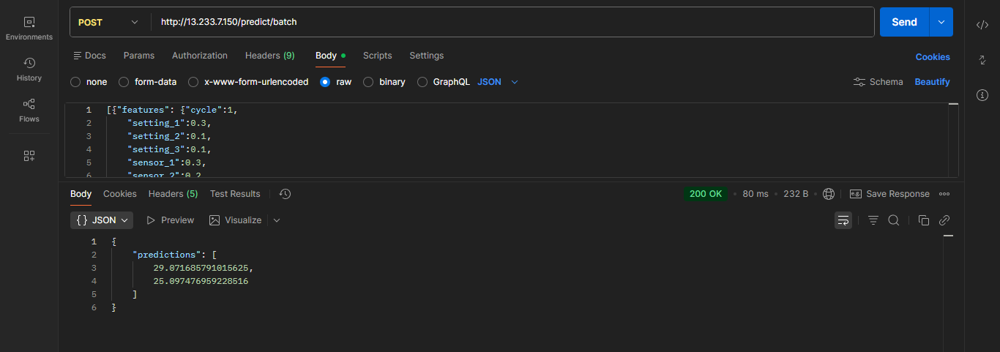
*Predictions from running API*

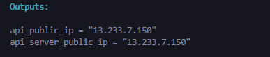
*IP of publically accessible API*

### 3. CI/CD Gates \& Rollback

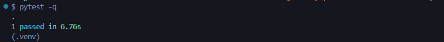
*Successfull tests using Pytest*

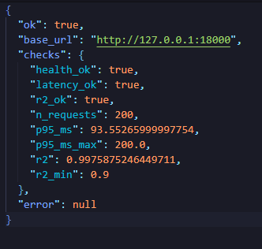
*Post-Deploy artifact*

*Before rollout*
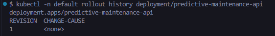

*After rollout*
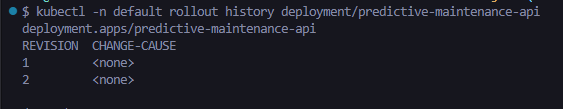

### 4. Production Monitoring

**Before `kubectl -n default apply -f infra/k8s/drift-check-job.yaml`:** Create IRSA ServiceAccount per ServiceAccountCreation.md (eksctl create iamserviceaccount for drift-dvc-reader).

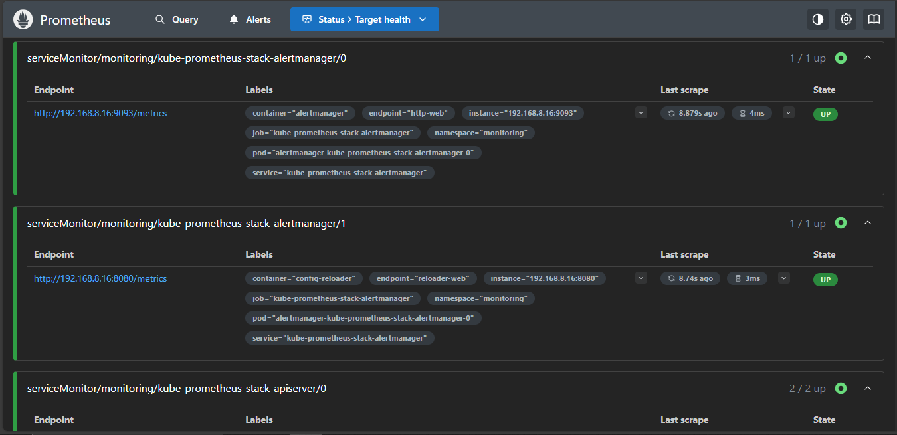
*Prometheus Targets UP*

*Grafana p95 panel*

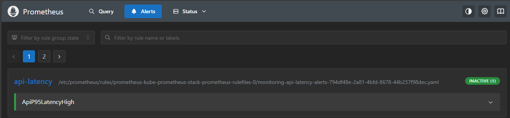
*alert FIRING at http://127.0.0.1:9090/alerts*

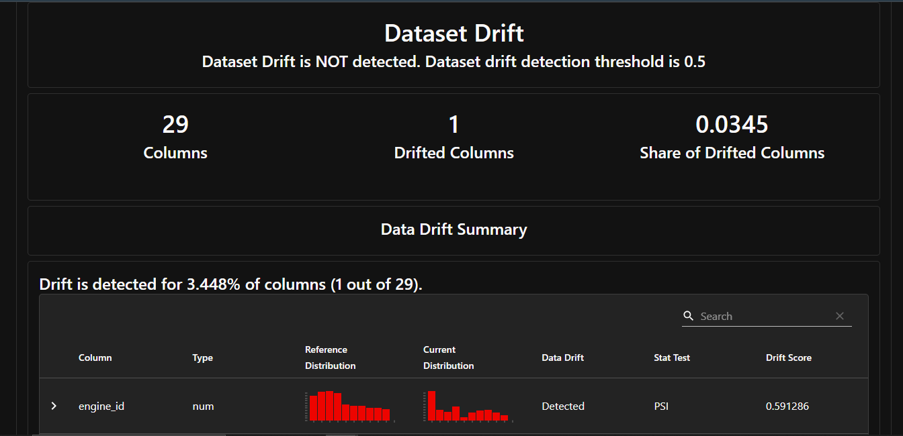
*In-cluster generated Evidently AI drift report*

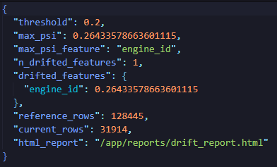
*Drift summary*

### 5. Collaboration Tools

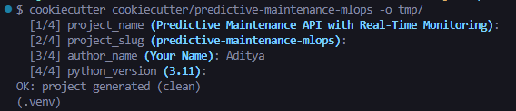
*Cookiecutter generated repo*

*Tests in generated repo*

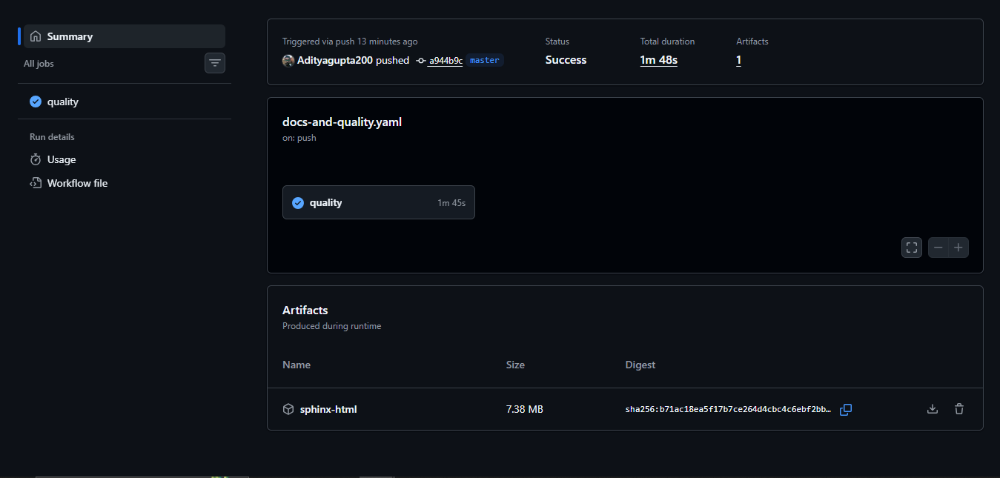
*docs-and-quality-workflow-run*

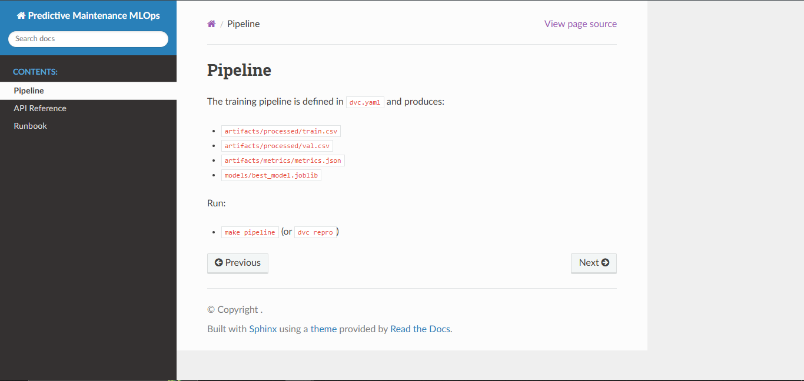
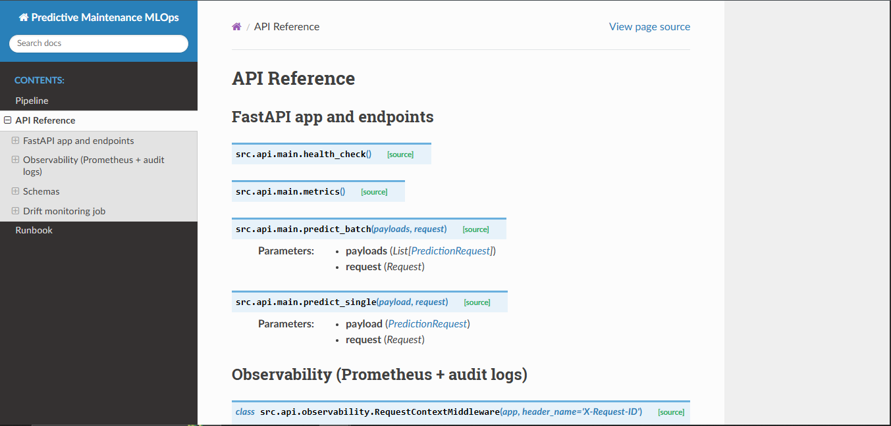
*Sphinx docs*

*MLFlow UI runs list*

## Pull Requests

- Run `pre-commit` hooks via `.pre-commit-config.yaml`.
- Update proofs in README.md with new artifacts.
- Target main branch; include production test screenshots.

## Cleanup Commands

- EKS: `eksctl delete cluster --name $CLUSTERNAME --region $AWSREGION`.
- Terraform: `cd infra/terraform; terraform destroy -auto-approve`.
- K8s/Monitoring: Uninstall kube-prometheus-stack, delete manifests/namespace.