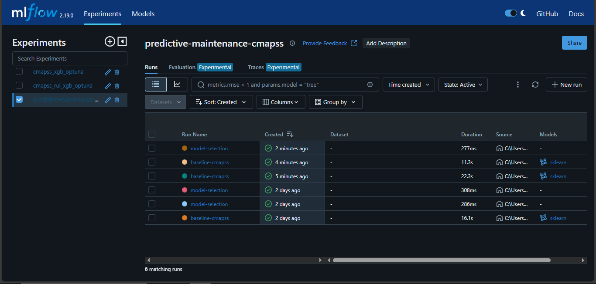
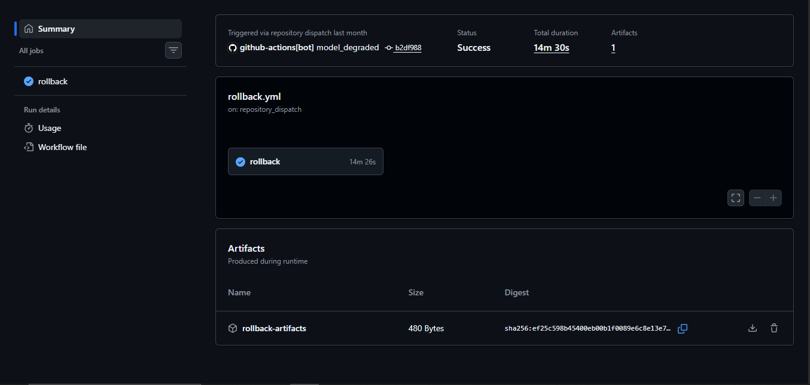
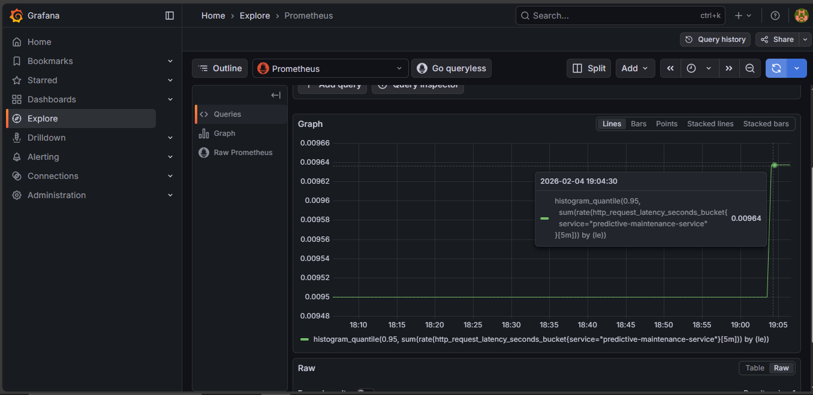
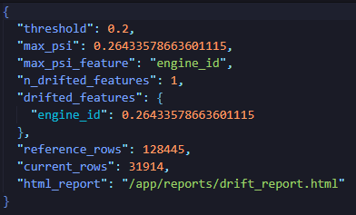

# Operational Runbook \& Production Verification

This document outlines the operational procedures for training, deploying, and monitoring the Predictive Maintenance MLOps pipeline. It includes verification steps and proof of production-level functionality.

## 1. Local Development \& Training Pipeline

**Command:**

```bash
make pipeline
```

Executes data preprocessing, model training, and evaluation.

**Verification Artifact:**



*MLFlow UI runs list*

## 2. API Serving (Local)

**Start API:**

```bash
make api
```

**Health Check:**

```bash
curl -X GET http://localhost:8000/health
```

**Test Prediction:**

```bash
curl -X POST http://localhost:8000/predict \
  -H "Content-Type: application/json" \
  -d @request.json
```


## 3. Production Deployment (Kubernetes)

**Deploy to Cluster:**

```bash
kubectl apply -f infra/k8s/deployment.yaml
kubectl apply -f infra/k8s/service.yaml
```

**Verification Artifact:**


*Running pod in EKS cluster*

## 4. CI/CD \& Automated Rollback

**Trigger Mechanism:**
Commit a "bad" model (simulated low accuracy) to master.
GitHub Actions pipeline runs post_deploy_gate.py.
If accuracy < threshold, the pipeline triggers a rollback to the previous image tag.

**Verification Artifact:**


*Screenshot of the GitHub Actions workflow run showing the "Deploy" step failing/triggering the "Rollback" job successfully.*

## 5. Production Monitoring (Prometheus \& Grafana)

**Prerequisites:** Ensure kube-prometheus-stack is installed:

```bash
helm upgrade --install kube-prometheus-stack prometheus-community/kube-prometheus-stack -n monitoring
```

**Generate Load (P95 Test):** Run the load generator to simulate traffic for 500 iterations:

```bash
kubectl -n default run loadgen --rm -i --restart=Never --image=curlimages/curl:8.6.0 -- \
  sh -c 'for i in $(seq 1 500); do curl -s -X POST http://predictive-maintenance-service/predict -H "Content-Type: application/json" -d '\''{"features": {"cycle":1, "setting_1":0.3, "setting_2":0.1, "setting_3":0.1, "sensor_1":0.3, "sensor_2":0.2, "sensor_3":0.1, "sensor_4":0.1, "sensor_5":0.5, "sensor_6":0.4, "sensor_7":0.3, "sensor_8":0.2, "sensor_9":0.1, "sensor_10":1.1, "sensor_11":1.6, "sensor_12":1.5, "sensor_13":1.4, "sensor_14":1.3, "sensor_15":1.2, "sensor_16":1.7, "sensor_17":1.5, "sensor_18":1.5, "sensor_19":1.4, "sensor_20":1.3, "sensor_21": 1.2, "cycle_norm":0.83}}'\'' > /dev/null; done'
```

**Visualisation Query (PromQL):**

```promql
histogram_quantile(0.95, sum(rate(http_request_latency_seconds_bucket{service="predictive-maintenance-service"}[5m])) by (le))
```

**Verification Artifacts:**


*Screenshot of the Grafana Dashboard showing the P95 latency panel.*


*Screenshot of the Prometheus AlertManager firing the HighLatency alert.*

## 6. Data Drift Detection (Evidently AI)

**Prerequisites (IRSA Setup):** Before running the drift check, ensure the drift-dvc-reader service account is created and annotated with the IAM Role ARN (as detailed in ServiceAccountCreation.md).

**Execute Drift Job:**

```bash
# 1. Apply the Drift Job Manifest
envsubst < infra/k8s/drift-check-job.yaml | kubectl -n default apply -f -

# 2. Wait for completion
kubectl -n default wait --for=condition=complete job/drift-check-now

# 3. Retrieve Report
POD=$(kubectl -n default get pods -l job-name=drift-check-now -o jsonpath='{.items[0].metadata.name}')
kubectl -n default cp "$POD":/app/reports ./reports_from_cluster -c keepalive
```

**Verification Artifact:**


*Screenshot or snippet of reports_from_cluster/drift_summary.json showing drift_share metrics.*

***