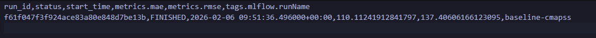

# MLflow Experiments and Comparisons

This directory contains Jupyter notebooks for MLflow experiment tracking and run comparisons as per production requirements.

## 01_mlflow_experiments.ipynb

Execute after starting MLflow UI: `mlflow ui --host 127.0.0.1 --port 5000`.

- Run the notebook to log training runs.
.
- Artifact: `notebooks/artifacts/runs_leaderboard.csv` – generated from notebook, shows top runs by metrics.

Proof command: `head -n 20 notebooks/artifacts/runs_leaderboard.csv`

## 02_compare_runs.ipynb

Loads runs from MLflow and generates comparison leaderboard.

- Run after 01_mlflow_experiments.ipynb.
- Compares params, metrics, artifacts across runs.

*p95 latency graph*

*Evidently AI HTML drift report*

All notebooks use `requirements-notebooks.txt` and integrate with DVC/MLflow for reproducibility.